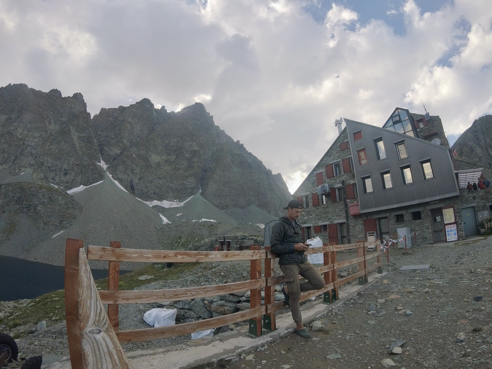
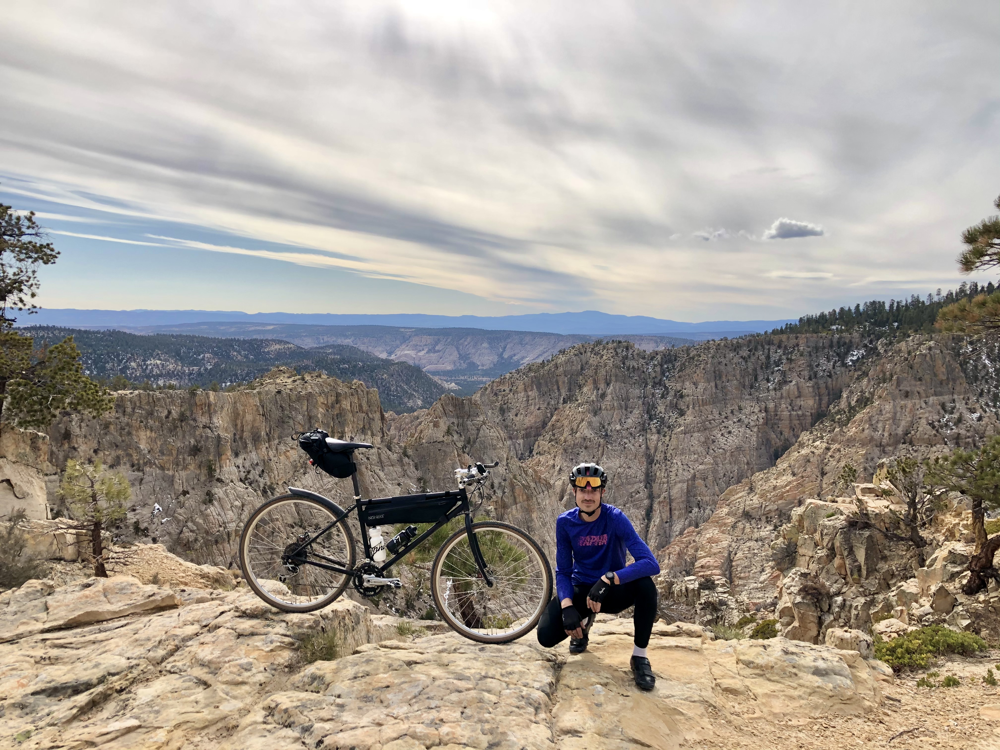
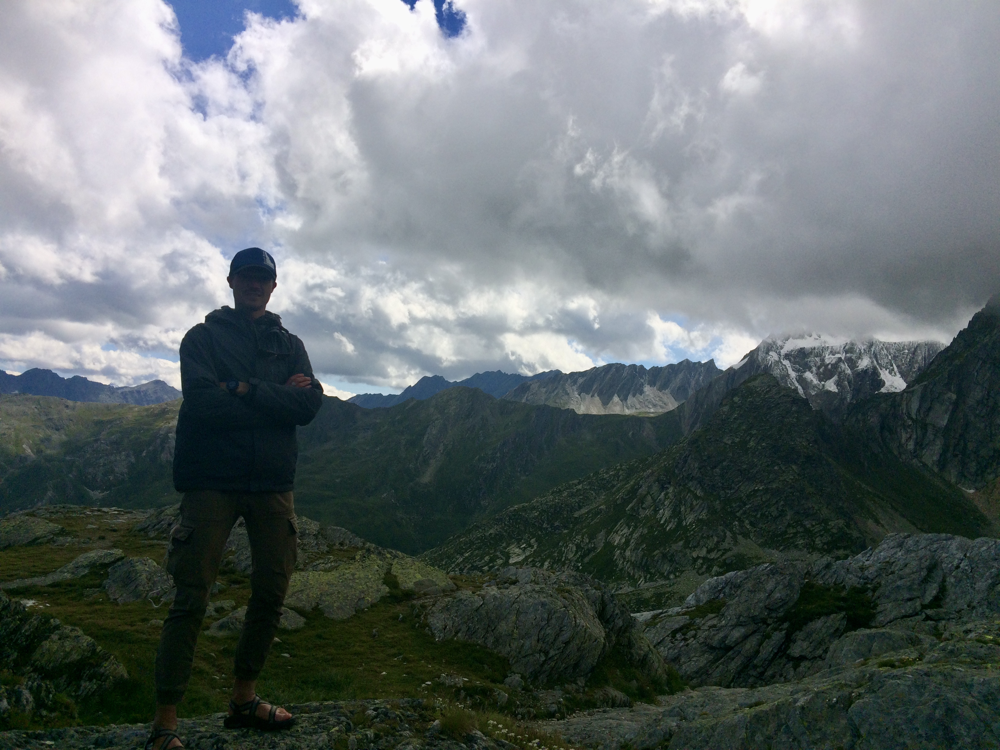

<!-- Main -->

<!-- Two -->
<section id="two" class="spotlights">
	<section>
		
		

			

				<header class="major">
					<h3>Geoscientist</h3>
				</header>
				
I am passionate about research and teaching. Geoscience datasets are sparse, expensive, and layered with complexity. These challenging problems are attractive and bless me with excuses to visit amazing places to look at wild rocks. In return, I focus on providing students opportunities for support and hands-on learning.

				<ul class="actions">
					<li><a href="https://scholar.google.com/citations?hl=en&user=O7TM22kAAAAJ" class="button">My published work</a></li>
          <li><a href="proposals.html" class="button">My current and proposed work</a></li>
				</ul>
			

		

	</section>
	<section>
		
		

			

				<header class="major">
					<h3>Athlete</h3>
				</header>
				
My athletic life is integral to who I am. When I'm not working, I'm usually training, racing, adventuring, or planning my next adventure. I have a healthy obsession with bicycles. 

				<ul class="actions">
					<li><a href="https://www.strava.com/athletes/11468816" class="button">Follow me on Strava</a></li>
					<li><a href="https://youtu.be/6GkO-Mz5uOo" class="button">See my latest adventure</a></li>
				</ul>
			

		

	</section>
	<section>
		
		

			

				<header class="major">
					<h3>Developer & Guide</h3>
				</header>
				
I dabble in machine learning, web app & software development, and guiding bicycle tours

				<ul class="actions">
					<li><a href="portfolio.html" class="button">View my portfolio</a></li>
				</ul>
			

		

	</section>
</section>

<!-- Three -->
<section id="three">
	

		<header class="major">
			<h2>Interested?</h2>
		</header>
		
Think I'm a good fit for your lab? Have funding or want to write a proposal? Please get in contact.

		<ul class="actions">
			<li><a href="resume.html" class="button next">Resumé</a></li>
      <li><a href="proposals.html" class="button next">Proposals</a></li>
		</ul>
	

</section>

