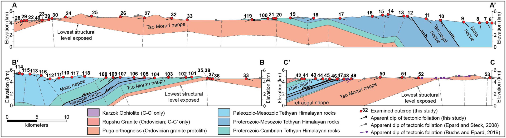

**Download:** [article.pdf](article.pdf)

## Summary

This field-based study examined the exhumation history of the Tso Morari nappe in NW India through detailed structural, microtextural, and thermochronological analyses.

---

*Figure:* Cross sections of our three mapped transects. Areas that exhibit similar apparent dip of tectonic foliation were divided into dip domains, which are separated by kink axes that bisect the interlimb angle (e.g., Suppe, 1983).

---

## Coauthors

- [Sean Long](https://scholar.google.com/citations?user=P9FprbkAAAAJ&hl=en&oi=ao) (Washington State University)
 - [Matthew Kohn](https://scholar.google.com/citations?user=xSyB1KQAAAAJ&hl=en) (Boise State University)
 - Jesslyn Starnes (Washington State University)
 - [Kyle Larson](https://scholar.google.com/citations?user=mPKPZPMAAAAJ&hl=en&oi=ao) (University of British Columbia)
 - [Noland Blackford](https://scholar.google.com/citations?user=Dao6M04AAAAJ&hl=en&oi=ao) (Washington State University)
 - [Emmanuel Soignard](https://scholar.google.com/citations?user=K3FWldkAAAAJ&hl=en&oi=ao) (Arizona State University)

## Acknowledgement

This work was supported by start-up funds awarded to S. Long from the Washington State University School of the Environment, as well as grants EAR1450507 and OIA1545903 awarded to MJK from the US National Science Foundation. We sincerely thank Dr. Talat Ahmad, Dr. Reyaz Ahmad Dar, Irfan Bhat, and Gulam Nabiley for assistance with travel logistics, permitting, field work, and sample shipping. We would like to thank associate editor Djordje Grujic and reviewers Richard Palin and Paris Xypolias for constructive and thoughtful reviews.

## Open Research

All of the data used for this research are contained within the manuscript and supplementary material. The data used for this research have been placed in the online data repository Zenodo [doi: 10.5281/zenodo.4287542](https://zenodo.org/record/4287542#.X7wSvrN7mUk).
