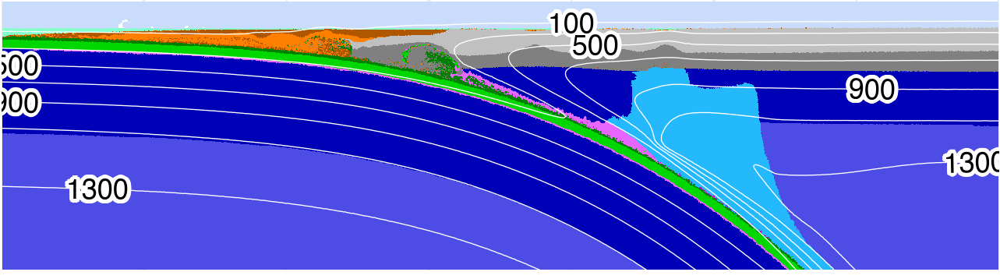

**Download:** [article.pdf](article.pdf)

## Summary

Mechanical coupling in subduction zones plays a critical role in controlling seismic activity, volcanism, and broader geodynamic processes. The idea that the depth of mechanical coupling remains consistent across diverse subduction zone segments ([Wada & Wang, 2009](https://agupubs.onlinelibrary.wiley.com/doi/abs/10.1029/2009GC002570)) prompts key questions: where, how, and why does mechanical coupling occur along the interface between converging tectonic plates?

To address these questions, this study develops 64 numerical geodynamic models of oceanic-continental convergent margins. By systematically varying thermo-kinematic boundary conditions, we establish relationships between these conditions and the depth of mechanical coupling. This modeling framework enables us to derive a predictive expression for coupling depth applicable to natural subduction systems.

---

*Figure:* Visualizations of standard model cdf78 at 5.05 Ma. By 5 Ma, the model achieves a balance between heat sinking from the upper mantle wedge to lower parts of the mantle and strong advection of heat in the circulating part of the mantle wedge. A feedback has already developed—heat advection inhibits antigorite stabilization to greater depths.

---

## Coauthors

- [Matthew Kohn](https://scholar.google.com/citations?user=xSyB1KQAAAAJ&hl=en) (Boise State University)
 - [Taras Gerya](https://scholar.google.com/citations?user=ek1H-_QAAAAJ&hl=en&oi=ao) (ETH Zürich)

## Acknowledgement

The authors thank the Geophysical Fluid Dynamics group at the Institut für Geophysik, ETH Zürich, for their computing resources and invaluable instruction, discussion, and support on the numerical modeling methods. The authors also thank P. Agard, L. Le Pourhiet, and their students at ISTeP, Sorbonne Université, for suggestions on the numerical modelling methods and discussions that greatly enhanced this study. The authors thank the anonymous reviewers for their helpful comments and suggestions, which greatly improved the manuscript. This work was supported by the National Science Foundation grant OISE 1545903 to M. Kohn, S. Penniston-Dorland, and M. Feineman.

## Open Research

All data, code, and relevant information for reproducing this work can be found at [https://github.com/buchanankerswell/kerswell_et_al_coupling](https://github.com/buchanankerswell/kerswell_et_al_coupling), and at [https://osf.io/zjac3/](https://osf.io/zjac3/), the official Open Science Framework data repository. All code is MIT Licensed and free for use and distribution (see license details).
