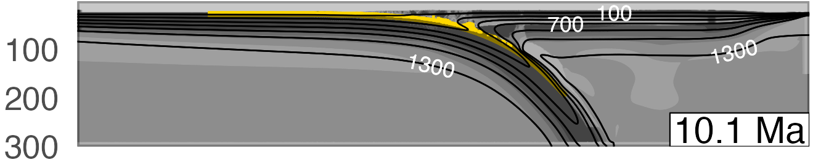

**Download:** [article.pdf](article.pdf)

## Summary

This work investigates and how many rocks get detached from subducting oceanic plates beneath convergent margins. Classification of over one-million numerical markers (representing rock fragments) from 64 numerical experiments indicates that rocks rock recovery likely happens at discrete depths, rather than continuously along the subduction interface.

---

*Figure:* Subduction simulation snapshot showing which markers were classified as recovered (gold) by our bespoke machine learning algorithm.(b) Grayscale represents the log viscosity (strength) of the materials and thick black contours are isotherms.

---

## Coauthors

- [Matthew Kohn](https://scholar.google.com/citations?user=xSyB1KQAAAAJ&hl=en) (Boise State University)
 - [Taras Gerya](https://scholar.google.com/citations?user=ek1H-_QAAAAJ&hl=en&oi=ao) (ETH Zürich)

## Acknowledgement

We gratefully acknowledge high-performance computing support from the Borah compute cluster ([https://doi.org/10.18122/oit/3/boisestate](https://doi.org/10.18122/oit/3/boisestate)) provided by Boise State University's Research Computing Department. We thank two anonymous reviewers who provided thoughtful feedback that greatly improved the manuscript. We also thank Whitney Behr for her editorial handling. This work was supported by the National Science Foundation Grant OISE 1545903 to M. Kohn, S. Penniston-Dorland, and M. Feineman.

## Open Research

All data, code, and relevant information for reproducing this work can be found at [https://github.com/buchanankerswell/kerswell_et_al_marx](https://github.com/buchanankerswell/kerswell_et_al_marx), and at [https://doi.org/10.17605/OSF.IO/3EMWF](https://doi.org/10.17605/OSF.IO/3EMWF), the official Open Science Framework data repository ([Kerswell et al., 2023](https://doi.org/10.17605/OSF.IO/3EMWF)). All code is MIT Licensed and free for use and distribution (see license details).
