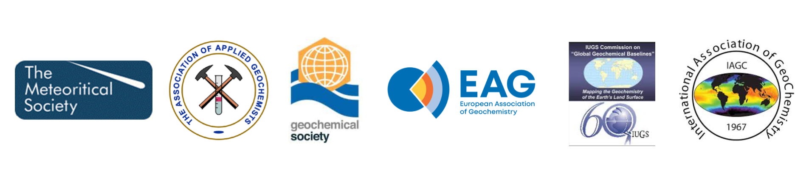

**Download:** [article.pdf](article.pdf)

**OneGeochemistry Page:** [https://onegeochemistry.github.io](https://onegeochemistry.github.io)

## Summary

This work emerged from a collaborative effort during a pre-conference workshop held at the Goldschmidt meeting in Honolulu, HI, on 8–9 July 2022. Our objective included developing recommendations that would enhance the infrastructure for storing and sharing geochemical data. In collaboration with the broader geochemical community, we launched OneGeochemistry---a community-driven initiative aimed at coordinating the development of a global, online network of machine-readable, persistent, interoperable, and reusable geochemical data.

---

*Figure:* The international geo- and cosmochemical societies above have endorsed OneGeochemistry as the trusted international initiative tasked with bringing together the community and coordinate global efforts in geochemical data standardization.

---

## Coauthors

Marthe Klöcking, Lesley Wyborn, Kerstin A Lehnert, Bryant Ware, Alexander M Prent, Lucia Profeta, Fabian Kohlmann, Wayne Noble, Ian Bruno, Sarah Lambart, Halimulati Ananuer, Nicholas D Barber, Harry Becker, Maurice Brodbeck, Hang Deng, Kai Deng, Kirsten Elger, Gabriel de Souza Franco, Yajie Gao, Khalid Mohammed Ghasera, Dominik C Hezel, Jingyi Huang, Buchanan Kerswell, Hilde Koch, Anthony W Lanati, Geertje ter Maat, Nadia Martínez-Villegas, Lucien Nana Yobo, Ahmad Redaa, Wiebke Schäfer, Megan R Swing, Richard JM Taylor, Marie Katrine Traun, Jo Whelan, Tengfei Zhou

## Acknowledgement

This manuscript is the result of a workshop held at the Goldschmidt 2022 conference hosted by the Geochemical Society. We thank Jerry Carter (IRIS) and Rob Casey (EarthScope) for helpful comments on the history of the development of data standards in seismology. Jay Pearlman, Rachel Przeslawski and Pauline Simpson provided valuable background information on OBPS. Richard Hartshorn and Leah McEwen provided detailed feedback on the practices in chemistry and crystallography. Michael Badawi, Jieun Kim and Nicolas Randazzo are thanked for their contributions to the Goldschmidt 2022 workshop. We thank Olivier Pourret for helpful comments on the preprint and are grateful to Tao Wen, Penny Wieser and Jamie Farquharson for their thoughtful and constructive reviews. We especially thank Jeff Catalano for the opportunity to publish this review in GCA and for expert editorial handling of the manuscript. MK is supported by the German Research Foundation (DFG grant 437919684). KL and LP acknowledge funding from US NSF Award Number 2148939 and NASA Grant Number 80NSSC19K1102. BW, AMP, and the AuScope Geochemistry Network are supported by AuScope and the National Collaborative Research Infrastructure Strategy (NCRIS). AMP is supported through AuScope which is a beneficiary in the WorldFAIR project, coordinated by CODATA, and funded by the European Union's HORIZON EUROPE Framework Programme (grant agreement 101058393). SL was supported by the NSF (EAR grant 1946346). NDB acknowledges funding from the NERC Centre for the Observation and Modelling of Earthquakes, Volcanoes and Tectonics (COMET), The Bill & Melinda Gates Foundation (Grant Number OPP1144), and the Gates Cambridge Trust. HB was supported by DFG CRC TRR 170 (project number 263649064). MB and HK are supported by Science Foundation Ireland (SFI) grant 13/RC/2092 and co-funded by iCRAG industry partners. HK is further supported by SFI grant 16/RP/3849. KD thanks the support by the ETH Zurich Postdoctoral Fellowship 20-1 FEL-24. DCH is supported through the NFDI4Earth funded by the DFG (project number 460036893). BK was supported by NSF grant OISE 1545903. AWL was funded by the Geological Society of Australia - Victorian Division, the German Research Exchange Service (DAAD Grant No. 57507869) and the Australian Government Research Training Program (Allocation No. 2018177). WS was funded by DFG grant KE 2395/3-1 (project number 447528294). MKT was supported by Geocenter Danmark (grant nr. GC4-2019). This is contribution 1760 from the ARC Centre of Excellence for Core to Crust Fluid Systems and 1529 in the GEMOC Key Centre.

## Open Research

Data and code availability follows community standards described in the manuscript.
