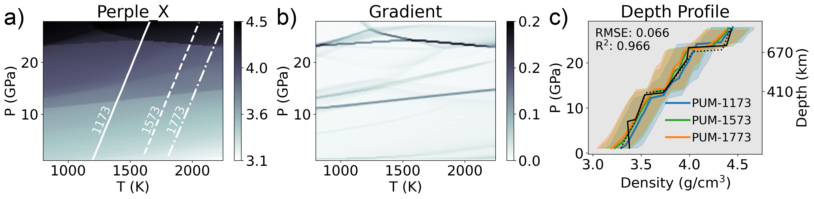

**Download:** [article.pdf](article.pdf)

## Summary

This study assesses the feasibility of using pre-trained machine learning models to predict rock properties in numerical geodynamic simulations of mantle convection. We generated a comprehensive dataset of rock properties using the Gibbs free energy minimization program [Perple_X](https://www.perplex.ethz.ch) (Connolly, 2009). Using this dataset, we trained a suite of machine learning regressors—collectively termed RocMLMs—and evaluated their accuracy and computational performance.

RocMLMs predict rock properties with accuracy comparable to conventional thermodynamic calculations but achieve speedups of 10$^1$–10$^3$ times. This substantial performance gain enables the incorporation of dynamically evolving rock properties into high-resolution mantle convection models for the first time.

---

*Figure:* A pseudosection model for a Primitive Upper Mantle composition (PUM, from Sun & McDonough, 1989) estimated by Perple_X ([Connolly, 2009](https://agupubs.onlinelibrary.wiley.com/doi/abs/10.1029/2009GC002540)) showing density (a), the gradient of density highlighting phase transitions (b), and density depth profiles along a range of hypothetical mantle geotherms (c). A total of 128$^3$ phase equilibria calculations (128 pseudosections at 128 $\times$ 128 PT resolution) were used to train RocMLMs.

---

## Coauthors

- [Nestor Cerpa](https://scholar.google.com/citations?user=D0kBGqcAAAAJ&hl=en&oi=ao) (CNRS & Géosciences Montpellier)
- [Andréa Tommasi](https://scholar.google.com/citations?user=4ibXyDwAAAAJ&hl=en) (CNRS & Géosciences Montpellier)
- [Marguerite Godard](https://scholar.google.com/citations?user=rhF-80oAAAAJ&hl=en&oi=ao) (CNRS & Géosciences Montpellier)
- [José Alberto Padrón-Navarta](https://scholar.google.com/citations?user=5x5JgpIAAAAJ&hl=en&oi=ao) (Instituto Andaluz de Ciencias de la Tierra)

## Acknowledgement

We gratefully thank Dr. Zhou Zhang and one anonymous reviewer for their thoughtful feedback that helped improved this work. We also thank Dr. Yangkang Chen and the editorial staff at JGR: MLC for their adept and efficient handling of this manuscript. This work was supported by the Tremplin-ERC Grant LEARNING awarded to Nestor Cerpa by the I-SITE excellence program at the Université de Montpellier. We thank Maurine Montagnat, Fernando Carazo, Nicolas Berlie, and many researchers and students at Géosciences Montpellier for their thoughtful feedback during the development of this work. We gratefully acknowledge additional support from the European Research Council (ERC) under the European Union Horizon 2020 Research and Innovation program Grant agreement No. 882450 (ERC RhEoVOLUTION) awarded to Andréa Tommasi.

## Open Research

All data, code, and relevant information for reproducing this work can be found at [https://github.com/buchanankerswell/kerswell_et_al_rocmlm](https://github.com/buchanankerswell/kerswell_et_al_rocmlm), and archived on the Open Science Framework data repository [https://doi.org/10.17605/OSF.IO/K23TB](https://doi.org/10.17605/OSF.IO/K23TB). All code is MIT Licensed and free for use and distribution (see license details). Reference models PREM and STW105 are freely available from the Incorporated Research Institutions for Seismology Earth Model Collaboration (IRIS EMC, doi: [10.17611/DP/EMC.1](https://doi.org/10.17611/DP/EMC.1), Trabant et al., 2012). All computations were made using CPUs of a Macbook Pro (2022; M2 chip) with macOS 14.5 and using Python 3.12.3.
