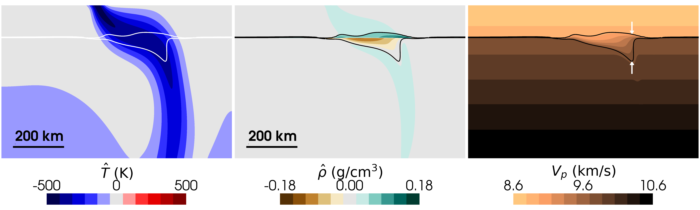

**Download:** [article.pdf](article.pdf)

## Summary

This study investigated how reaction rates (kinetics) and rock strength affect the structure and displacement of Earth's 410 km mantle discontinuity during the olivine $\Leftrightarrow$ wadsleyite phase transition. By simulating both hot mantle plumes and cold subducting slabs across a wide range of kinetic parameters, we evaluated how disequilibrium influences seismic observations. We show that while high temperatures in plumes consistently maintain a sharp transition, cold subduction zones are heavily controlled by kinetics, where slower reaction rates widen the boundary, displace it downward, and create metastable olivine wedges that impede slab descent.

---

*Figure:* Slab simulations with intermediate strength contrasts ($B$ = 4, viscosity contrast $\sim$ 3$\times$) and intermediate kinetic regime (middle row: $Z$ = 1.5e-5 K$^{-1}$ s$^{-1}$) after 100 Ma evolution. Panels show dynamic temperature $\hat{T}$ (left column), dynamic density $\hat{\rho}$ (middle column), and pressure-wave velocity $V_p$ (right column). Thin lines highlight the 10% and 90% wadsleyite volume fraction contours ($X$ = 0.1 and 0.9). The 410 displacement is defined as the difference between the depth at X = 0.9 and the nominal equilibrium olivine $\Leftrightarrow$ wadsleyite transition depth, while the 410 width is defined as the difference between depths at X = 0.9 and X = 0.1 (see Supplementary Information for details). The white arrows (right column) indicate where the 410 structure was measured.

---

## Coauthors

- [John Wheeler](https://scholar.google.com/citations?user=jsfp2-8AAAAJ&hl=en&oi=ao) (Department of Earth, Oceans and Ecological Sciences, University of Liverpool)
- [Rene Gassmöller](https://scholar.google.com/citations?user=Vk8SmssAAAAJ&hl=en&oi=ao) (GEOMAR Helmholtz Centre for Ocean Research Kiel)
- [J. Huw Davies](https://scholar.google.com/citations?user=T5ygdwcAAAAJ&hl=en&oi=ao) (School of Earth and Environmental Sciences, Cardiff University)
- Isabel Papanagnou (Bullard Laboratories, Department of Earth Sciences, University of Cambridge)
- [Sanne Cottaar](https://scholar.google.com/citations?user=l5JtmzkAAAAJ&hl=en&oi=ao) (Bullard Laboratories, Department of Earth Sciences, University of Cambridge)

## Acknowledgement

This work was funded by the UKRI NERC Large Grant no. NE/V018477/1. All computations were undertaken on Barkla2, part of the High Performance Computing facilities at the University of Liverpool, who graciously provided expert support. We thank the Computational Infrastructure for Geodynamics ([https://geodynamics.org](https://geodynamics.org)) which is funded by the National Science Foundation under award EAR-0949446 and EAR-1550901 for supporting the development of ASPECT. We also extend our gratitude towards Sujoy Ghosh for his editorial handling, and two anonymous reviewers for their constructive feedback that improved the manuscript.

## Open Research

All data, code, and relevant information for reproducing this work are archived on the OSF ([Kerswell, 2026a](https://doi.org/10.17605/OSF.IO/9PHWC)) and Zenodo ([Kerswell, 2026b](https://doi.org/10.5281/zenodo.19662566)) repositories. All code within these repositories is MIT Licensed and free for use and distribution (see license details). ASPECT version 3.0.0 ([Bangerth et al., 2024](https://doi.org/10.5281/zenodo.14371679)) was used for the computations in this study and is freely available under the GPL v2.0 or later license.
