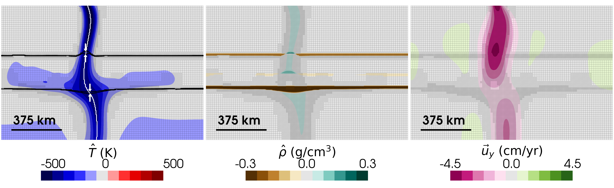

**Download:** [preprint.pdf](preprint.pdf)

## Summary

This study investigated how reaction rates (kinetics) during ringwoodite decomposition control the seismic structure and displacement of Earth's 660 km mantle discontinuity within subducting slabs and mantle plumes. By incorporating diffusion-controlled kinetic parameters into compressible mantle flow simulations, we evaluated how disequilibrium influences slab dynamics and mantle transition zone behavior. We show that while hot plumes maintain narrow, kinetics-insensitive 660 km boundaries, cold subducting slabs are strongly regulated by kinetics---where slower reaction rates create metastable ringwoodite, amplify boundary deflections by a factor of 2–4, and actively promote slab stagnation.

---

*Figure:* Reference slab simulations with moderate inflow velocity, intermediate slab strength, no lower-mantle viscosity jump, and an intermediate kinetic regime (middle row: $Z_\mathrm{ri}$ = 6.0 $\times$ 10$^{-1}$ mol$^2$ J$^{-2}$ s$^{-1}$) after 100 Ma. Columns show dynamic temperature $\hat{T}$ (left column), dynamic density $\hat{\rho}$ (middle column), and vertical velocity $\vec{u}_y$ (right column). Thick black lines (left column) highlight the 10% and 90% wadsleyite and post-spinel volume fraction contours used to define 660 displacement and width. The background grid pattern indicates ASPECT's adaptive mesh refinement near high thermal gradients and phase transitions. White trace (left column) indicates the representative depth profile used to extract data, and the white arrows indicate where the 660 structure is evaluated.

---

## Coauthors

- [John Wheeler](https://scholar.google.com/citations?user=jsfp2-8AAAAJ&hl=en&oi=ao) (Department of Earth, Oceans and Ecological Sciences, University of Liverpool)
- [Rene Gassmöller](https://scholar.google.com/citations?user=Vk8SmssAAAAJ&hl=en&oi=ao) (GEOMAR Helmholtz Centre for Ocean Research Kiel)
- [J. Huw Davies](https://scholar.google.com/citations?user=T5ygdwcAAAAJ&hl=en&oi=ao) (School of Earth and Environmental Sciences, Cardiff University)
- Isabel Papanagnou (Bullard Laboratories, Department of Earth Sciences, University of Cambridge)
- [Sanne Cottaar](https://scholar.google.com/citations?user=l5JtmzkAAAAJ&hl=en&oi=ao) (Bullard Laboratories, Department of Earth Sciences, University of Cambridge)

## Acknowledgement

This work was funded by the UKRI NERC Large Grant no. NE/V018477/1. All computations were undertaken on Barkla2, part of the High Performance Computing facilities at the University of Liverpool, who graciously provided expert support. We thank the Computational Infrastructure for Geodynamics ([https://geodynamics.org](https://geodynamics.org)) which is funded by the National Science Foundation under award EAR-0949446 and EAR-1550901 for supporting the development of ASPECT. We also extend our gratitude towards Sujoy Ghosh for his editorial handling, and two anonymous reviewers for their constructive feedback that improved the manuscript.

## Open Research

All data, code, and relevant information for reproducing this work are archived on the OSF ([Kerswell, 2026a](https://doi.org/10.17605/OSF.IO/KUR93)) and Zenodo ([Kerswell, 2026b](https://doi.org/10.5281/zenodo.21810741)) repositories. All code within these repositories is MIT Licensed and free for use and distribution (see license details). ASPECT version 3.0.0 ([Bangerth et al., 2024](https://doi.org/10.5281/zenodo.14371679)) was used for the computations in this study and is freely available under the GPL v2.0 or later license.
