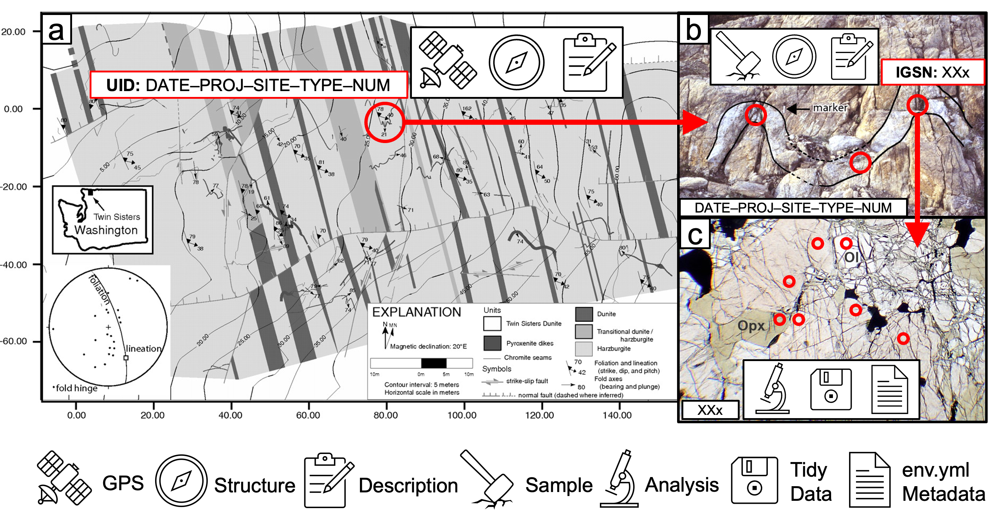

## Summary

Over the past decade, machine learning and artificial intelligence have grown into essential tools across the geosciences, serving as practical extensions to traditional methods rather than complete replacements for handling large, complex datasets. To demonstrate these applications in practice, this chapter presents a worked, transferable end-to-end workflow analyzing strain data from the Twin Sisters ultramafic complex. I aim to build a practical foundation in key machine learning concepts, highlighting how these methods connect with classic geological reasoning and advance research in tectonics and related subfields.

---

*Figure:* Geological map of the Twin Sisters ultramafic body (Washington, USA) illustrating the concept of using “spots” (red circles) as a basis for constructing a hierarchical dataset. (a) Each spot at the mapping-scale is spatially located on a topographic basemap using GPS and assigned a unique ID (UID). (b) Each spot at the outcrop-scale is spatially located on an outcrop photograph and assigned an IGSN. (c) Each spot at the subsample scale is spatially located on a photomicrograph and compiled into a Tidy data table. Tidy data tables are always accompanied by a metadata file that provides the necessary analytical parameters and computational environment to understand and reproduce the analysis. This strategy ensures raw data, observations, and spatial relationships at different scales are tied together in sets of stable, uniquely identified spots and basemaps. Basemap and outcrop image are from [Tikoff et al. (2010)](https://doi.org/10.1130/L97.1). Thin-section image is from [https://optical.minpet.org](https://optical.minpet.org).

---
