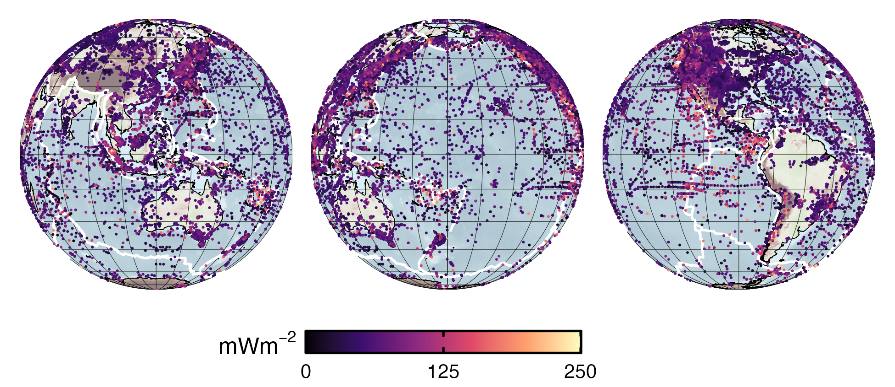

**Download:** [preprint.pdf](preprint.pdf)

## Summary

This work investigated the spatial continuity of surface heat flow near subduction zones. We compared two different interpolations methods, *Similarity* and *Kriging* with surface heat flow data from the Global Heat Flow Data Assessment Group et al. ([2024](https://doi.org/10.5880/fidgeo.2024.014)). Our analysis showed that along-strike surface heat flow continuity near subduction zones is ambiguous or geographically limited, not globally uniform.

---

*Figure:* Global surface heat flow observations. A total of 91,182 raw, unfiltered surface heat flow observations were used for spatial analysis. Filtered and deduplicated data within 34 domains near subduction zones ($N_\mathrm{obs}$ = 60,316 total) show uneven, irregular distributions regionally and globally. Note the relatively high observation density in N America and around the N Pacific compared to the S Pacific.

---

## Coauthors

- [Matthew Kohn](https://scholar.google.com/citations?user=xSyB1KQAAAAJ&hl=en) (Boise State University)

## Acknowledgement

We express our sincere gratitude to the communities, institutions, and research teams who develop and maintain the open-source datasets used in this study. Specifically, we thank the creators of the SubMap tool (Géosciences Montpellier); the University of Texas Institute for Geophysics for the plate boundary compilation; the NOAA National Centers for Environmental Information for the ETOPO 2022 global relief model; the Global Heat Flow Data Assessment Group for maintaining the Global Heat Flow Database; and F. Lucazeau for providing the Similarity interpolations. This work was supported by the National Science Foundation grants OIA 1545903 to M. Kohn, S. Penniston-Dorland, and M. Feineman and EAR 2118114 to M. Kohn.

## Open Research

All data, code, and relevant information for reproducing this work are archived on the OSF (Kerswell, [2026a](https://doi.org/10.17605/OSF.IO/CA6ZU)) and Zenodo (Kerswell, [2026b](https://doi.org/10.5281/zenodo.21790947)) repositories. All code within these repositories is MIT Licensed and free for use and distribution (see license details). All spatial datasets used in this study are open-source: transects from the SubMap tool version 7.1 (Lallemand et al., [2026](https://submap.fr)); present-day plate boundaries from Coffin et al. ([2018](http://www-udc.ig.utexas.edu/external/plates/data.htm)); global relief model from NOAA National Centers for Environmental Information ([2022](https://doi.org/10.25921/fd45-gt74)); surface heat flow observations from the Global Heat Flow Data Assessment Group et al. ([2024](https://doi.org/10.5880/fidgeo.2024.014)); and Similarity interpolations from Lucazeau ([2019](https://doi.org/10.1029/2019GC008389)).
