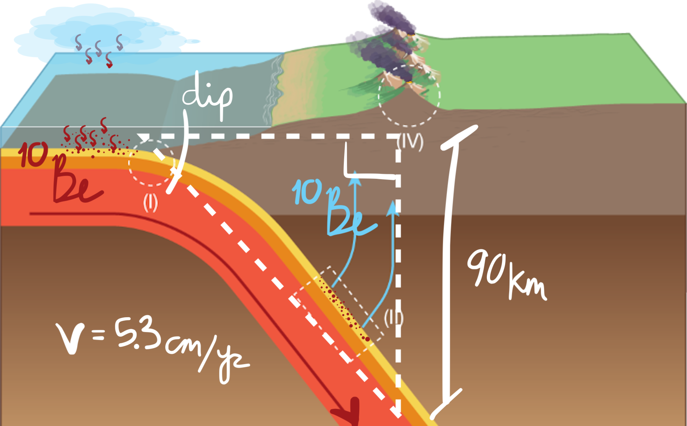

**Download:** [handout.pdf](handout.pdf)

A lab exercise focusing on the nuances of analyzing data from open-source geochemical repositories. I use this handout in my petrology courses. To be submitted to the [Exemplary Reviewed Activity Collection](https://serc.carleton.edu/teachearth/exemplary.html) maintained by the NAGT.

***Figure:*** *Problem setup. Figure modified after Plank & Manning ([2019](https://www.nature.com/articles/s41586-019-1643-z).*
