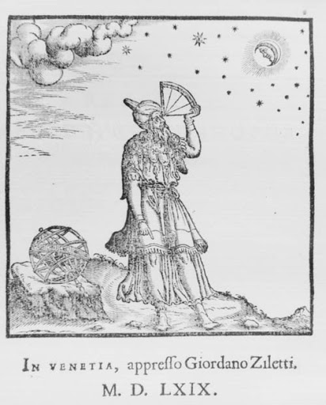
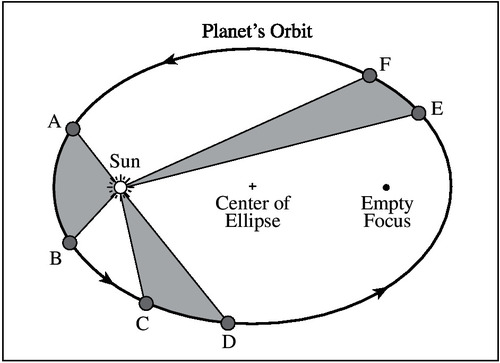
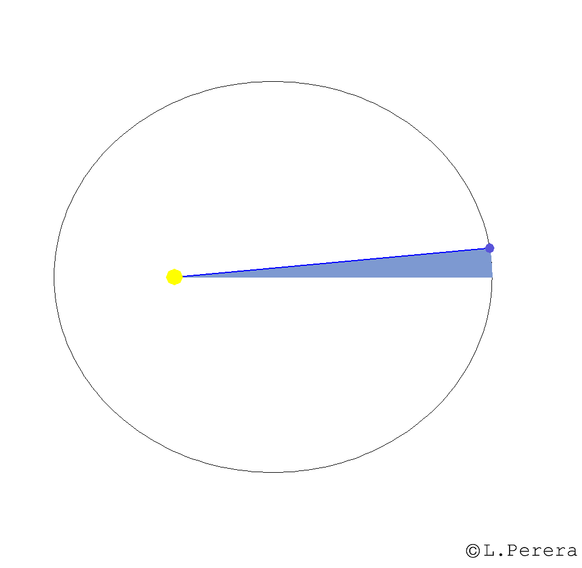

```{r setup, include=FALSE}
knitr::opts_chunk$set(echo = FALSE, fig.align = 'center', message = FALSE, warning = FALSE)
library(tidyverse)
library(patchwork)
library(knitr)
library(lubridate)
library(moonsun)
library(zoo)
library(wesanderson)
library(kableExtra)
library(ggrepel)
options('latitude' = 43.6150, 'longitude' = 116.2023)
d.kepler <- read_delim('./data/kepler.txt', delim = ' ') %>%
  mutate(const = (m.dist^3)/(period^2))
d.tides <- read_delim('./data/ib_tides.txt', delim = '\t') %>%
  mutate(Date = as.POSIXct(paste(Date, Time)), .before = Pred) %>%
  select(-Time, -Day)
dz.temp <- read_csv('./data/nz_temp.csv')
db.temp <- read_csv('./data/boise_temp.csv') %>% mutate('TAVG' = (TAVG-32)*5/9)
de.temp <- read_csv('./data/ec_temp.csv')
d.temp <- db.temp %>% full_join(de.temp) %>% full_join(dz.temp) %>% rename(Date = DATE)
d.temp$STATION[grep('US*', d.temp$STATION)] <- 'Boise'
d.temp$STATION[grep('EC*', d.temp$STATION)] <- 'Ecuador'
d.temp$STATION[grep('CG*', d.temp$STATION)] <- 'DRC'
d.temp$STATION[grep('NZ*', d.temp$STATION)] <- 'N.Zealand'
p.sun <- sun(jd(year = 2000, month = 01, day = 01, length = 1825)) %>%
  as_tibble(rownames = 'Date') %>%
  mutate('Date' = as_date(substr(Date, 1, 10))) %>%
  rename(`Right Ascension` = ra, Declination = d, Phase = phase, Angle = angle, `Dist from Earth` = dist, Size = size) %>%
  select(-c(Phase, Angle))
p.moon <- moon(jd(year = 2020, month = 09, day = 30, length = 32)) %>%
  as_tibble(rownames = 'Date') %>%
  mutate('Date' = as_date(substr(Date, 1, 10))) %>%
  rename(`Right Ascension` = ra, Declination = d, Phase = phase, Angle = angle, `Dist from Earth` = dist, Size = size)
h <- d.tides %>%
  filter(`High/Low` == 'H') %>%
  select(-`High/Low`) %>%
  rename(`High Tide` = Pred)
l <- d.tides %>%
  filter(`High/Low` == 'L') %>%
  select(-`High/Low`) %>%
  rename(`Low Tide` = Pred)
d <- p.moon %>%
  mutate('Date' = as.POSIXct(Date)) %>%
  full_join(h) %>%
  full_join(l) %>%
  mutate(`Right Ascension` = as.numeric(`Right Ascension`),
         'Declination' = as.numeric(Declination)) %>%
  select(Date, where(is.numeric), -mag) %>%
  pivot_longer(-Date, names_to = 'var', values_to = 'val')
```

## Trivia! {.tabset .vline}

### The Word 'Planet'

The word 'planet' comes from the Greek word, 'planetes', which means 'wanderer'.

$$\pi\lambda\alpha\nu\eta\tau\eta\sigma\atop "wanderer"$$
<center>



</center>

### Johannes Kepler

Johannes Kepler was a German astronomer and mathematician famous for his laws of planetary motion. He derived his laws using data from another astronomer, Tycho Brahe, who infamously wore a golden prosthetic nose after his own was removed in a duel.

<center>


</center>

### Invention of the Telescope

The first patented telescope was invented in the Netherlands in 1608. The Italian astronomer and Kepler's contemporary, Galileo Galilei, made his own version in 1609.

<center>


</center>

### Patterns in Data

Kepler's laws of planetary motion are 'empirical'. They were constructed based on patterns he observed and measured, rather than from theory.

> Keep in your mind where Boise, the Democratic Republic of Congo (DRC), and New Zealand are while viewing the following figure. Can you find any patterns?

For example:

  * What is the temperature when the Earth is closest to the Sun?
  * What is the temperature when the Earth is farthest from the Sun?
  * Do you see the same patterns for Boise, the DRC, and New Zealand?

```{r temp, fig.width=11, fig.height=6.1875, fig.cap="Figure 4. Average daily air temperature for Boise, the Democratic Republic of Congo (DRC), and New Zealand. Black dots are data points and colored lines are 20-day moving averages. The Sun's distance relative to Earth is plotted (large black points) on a different scale. Notice the differences in relative amplitudes, wavelengths, and phase of the seasonal temperature changes at these three locations."}
d.temp %>%
  group_by(STATION) %>%
  filter(STATION != 'Ecuador') %>%
  ggplot() +
  geom_point(aes(x = Date, y = TAVG, group = STATION), color = 'black', size = 0.1, alpha = 0.5, na.rm = TRUE) +
  geom_line(aes(x = Date, y = rollmean(TAVG, 20, na.pad = TRUE), group = STATION, color = STATION), size = 1, alpha = 0.8, na.rm = TRUE) +
  geom_point(data = p.sun, aes(x = Date, y = rollmean(`Dist from Earth`, 20, na.pad = TRUE)*200-210, size = `Dist from Earth`), color = 'black', alpha = 0.5, na.rm = TRUE) +
  geom_segment(aes(x = ymd(20010101), xend = ymd(20011101), y = -20, yend = -13), arrow = arrow(angle = 20, length = unit(0.1, 'inches'), type = 'closed')) +
  annotate('text', x = ymd(20010101), y = -20, label = 'Sun Position', hjust = 1) +
  scale_color_manual(values = wes_palette("Moonrise3", n = 3, type = 'continuous')) +
  scale_size_continuous(name = "Sun's Distance from Earth", range = c(0.5,2)) +
  scale_x_date(limits = c(ymd(20000101), ymd(20050101))) +
  xlab('Date') +
  ylab('Temperature (Celcius)') +
  labs(title = "Average Daily Temperature and the Sun's Position") +
  theme_minimal(base_size = 12) +
  theme(
        legend.position = 'bottom'
        ) +
  guides(color = guide_legend(title.position = 'top'),
         size = guide_legend(title.position = 'top', label.position = 'bottom', override.aes = list(alpha = 1)))
```

## Explore the Night Sky {.tabset .vline}

> Look at the night sky. Track the positions of the planets with one eye on the calendar date. Can you find any patterns?

For example:

  * How long does it each planet to move from its highest-lowest-highest point in the sky?
  * Is there any relationship between the duration of one 'highest-lowest-highest' cycle and the planet's distance from the sun? 

### Up-Down Position

<center>


</center>

### Up-Down & Right-Left Position

<center>


</center>

## Kepler's Discovery {.tabset .vline}

### The Pattern

> Take a few moments to describe in words the pattern(s) you observed in the previous animations---especially how the duration of highest-lowest-highest cycles change as a function of distance from the Sun.

### The Discovery

Below is Kepler's original data in table and graphical form.

> Take a moment to view the table and figure. Did you find a similar pattern as Kepler?

```{r kepdata}
d.kepler %>%
  kable(caption = 'Table 1. Keplers original data from which he derived his empirical 3rd law', format.args = list(scientific = FALSE), col.names = c('Planet', 'Distance from Sun (r)', 'Orbital Period (T)', '$\\frac{r^3}{T^2}$')) %>%
  kable_styling(bootstrap_options = c('condensed', 'striped'), full_width = FALSE)
```

```{r kepfig, fig.cap="Figure 7. Kepler's discovery in graphical form. The farther a planet is from the Sun, the longer its orbital period."}
d.kepler %>% 
  ggplot() +
  geom_point(aes(x = m.dist, y = period, color = planet), size = 3, show.legend = FALSE) +
  geom_label_repel(aes(x = m.dist, y = period, label = planet), hjust = -0.2, direction = 'y', segment.alpha = 0.2, show.legend = FALSE) +
  xlab('Log Distance from Sun (AU)') +
  ylab('Log Orbital Period (Days)') +
  labs(title = "Kepler's Discovery") +
  scale_color_manual(values = wes_palette("Moonrise3", n = 6, type = 'continuous')) +
  scale_x_log10() +
  scale_y_log10() +
  theme_grey(base_size = 14)
```

### Kepler's Laws

Kepler's three laws of planetary motion:

> 1. All planets have elliptical orbits, with the sun at one focus

<center>



</center>

> 2. A line segment joining a planet and the Sun sweeps out equal areas during equal intervals of time

<center>



</center>

> 3. The square of a planet's orbital period is proportional to the cube of the length of the semi-major axis of its orbit

Although Kepler derived his law empirically, it was Sir Isaac Newton's discovery of gravity and its effects on orbiting bodies that codified our understanding of Kepler's third law. The derivation usually starts with the conservation of angular momentum, which Kepler and his contemporaries had no formal understanding of at the time.

In the case of a circular orbit, we can set the centripetal force equal to the gravitational force:

$$mr\omega^2 = G\frac{mM}{r^2}$$

where $m$ is the mass of an object orbiting a more massive object, $M$. $\omega$ is the angular momentum, $G$ is the gravitational constant, and $r$ is the distance between the two orbiting bodies.

By expressing angular velocity in terms of orbital period ($\omega = 2\pi/T$):

$$mr \left( \frac{2\pi}{T} \right) ^2 = G\frac{mM}{r^2} \rightarrow T^2 = \left( \frac{4\pi^2}{GM} \right) r^3 \rightarrow T^2 \propto r^3$$

What Kepler actually noticed was that the ratio between the cubed semi-major axis and the square of the orbital period was constant:

$$\frac{a^3}{T^2} \approx \frac{GM}{4\pi^2} \approx 7.496\cdot10^-6 \left( \frac{AU^3}{days^2} \right) is~a~constant$$

## The Moon and Tides {.tabset .vline}

Neither Kepler, nor his contemporaries had any idea about gravitation. Nonetheless, Kepler developed his own theories about the effects of the moon on ocean tides.

> Ponder the closeness of our moon and its gravitational pull while viewing the following figures. Can you find any patterns?

### H & L Tides

```{r tides, fig.width=11, fig.height=6.1875, fig.cap="Figure 10. The predicted high and low tides (blue line) from September 30, 2020 to November 1, 2020 at Imperial Beach, California. The Moon's phase (black-pink curve) and distance relative to Earth (black dots) are plotted for the same date range. Notice where the tides are strongest and weakest."}
d.tides %>% 
  group_by(`High/Low`) %>%
  ggplot() + 
  geom_line(aes(x = Date, y = Pred), size = 1, color = 'navy', alpha = 0.75) +
  geom_line(data = p.moon, aes(x = as.POSIXct(Date), y = Phase/100*2, color = Phase), size = 3, alpha = 0.7, lineend = 'round', linejoin = 'round', linemitre = 1) +
  geom_point(data = p.moon, aes(x = as.POSIXct(Date), y = `Dist from Earth`, size = `Dist from Earth`)) +
  xlab('Date') +
  ylab('Water Level (m)') +
  labs(title = "Tides and the Moon's Position") +
  scale_x_datetime(date_breaks = '2 day', date_labels = '%b %d') +
  scale_size_continuous(name = 'Distance from Earth', range = c(1,4)) +
  scale_color_gradient(name = 'Moon Phase', low = 'black', high = 'pink2', breaks = c(0, 50, 100)) +
  theme_minimal(base_size = 12) +
  theme(axis.text.x = element_text(angle = 40, vjust = 0.6),
        legend.position = 'bottom') +
  guides(color = guide_colorbar(title.position = 'top'),
         size = guide_legend(title.position = 'top', label.position = 'bottom'))
```


### H or L Tides

```{r tides2, fig.width=11, fig.height=6.1875, fig.cap="Figure 11. The tides dataset, faceted to emphasize high (H) and low (L) tides."}
d.tides %>% 
  group_by(`High/Low`) %>%
  ggplot() + 
  geom_line(aes(x = Date, y = Pred), size = 1, color = 'navy', alpha = 0.75) +
  geom_line(data = p.moon, aes(x = as.POSIXct(Date), y = Phase/100*2, color = Phase), size = 3, alpha = 0.7, lineend = 'round', linejoin = 'round', linemitre = 1) +
  geom_point(data = p.moon, aes(x = as.POSIXct(Date), y = `Dist from Earth`, size = `Dist from Earth`)) +
  xlab('Date') +
  ylab('Water Level (m)') +
  labs(title = "High Tide, Low Tide, and the Moon's Position") +
  scale_x_datetime(date_breaks = '2 day', date_labels = '%b %d') +
  scale_size_continuous(name = 'Distance from Earth', range = c(0.5, 2)) +
  scale_color_gradient(
    name = 'Moon Phase',
    low = 'black',
    high = 'pink2',
    breaks = c(0, 50, 100)
  ) +
  theme_minimal(base_size = 12) +
  theme(axis.text.x = element_text(angle = 40, vjust = 0.6),
        legend.position = 'bottom') +
  guides(
    color = guide_colorbar(title.position = 'top'),
    size = guide_legend(title.position = 'top', label.position = 'bottom')
  ) +
  facet_wrap(~ `High/Low`)
```

## Wrap up

> Reflect on the patterns you observed in global temperatures, tides, and the positions of the moon, sun, and planets
>
> - What was your favorite visualization?
> - Which pattern did you find the most pronounced?
> - How did you find the visualizations helpful in recognizing patterns in natural phenomena?
