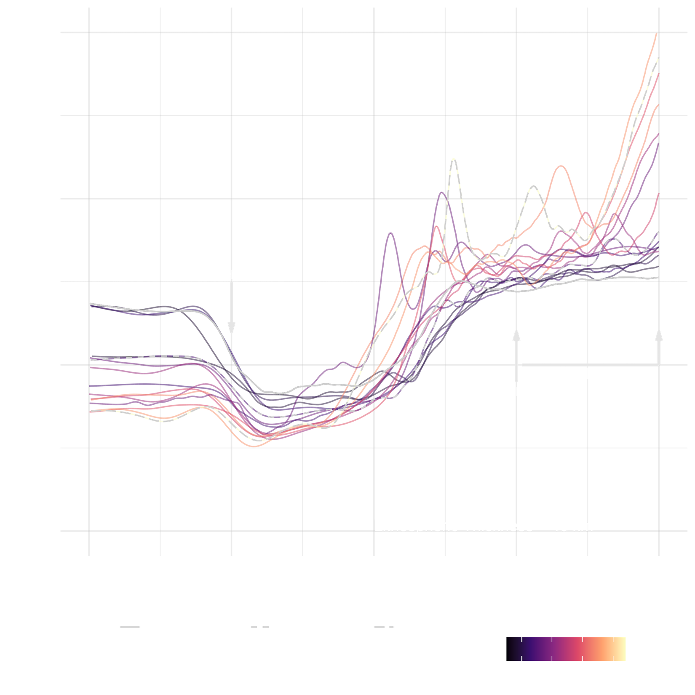
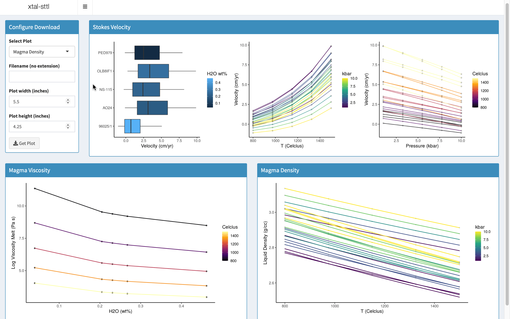
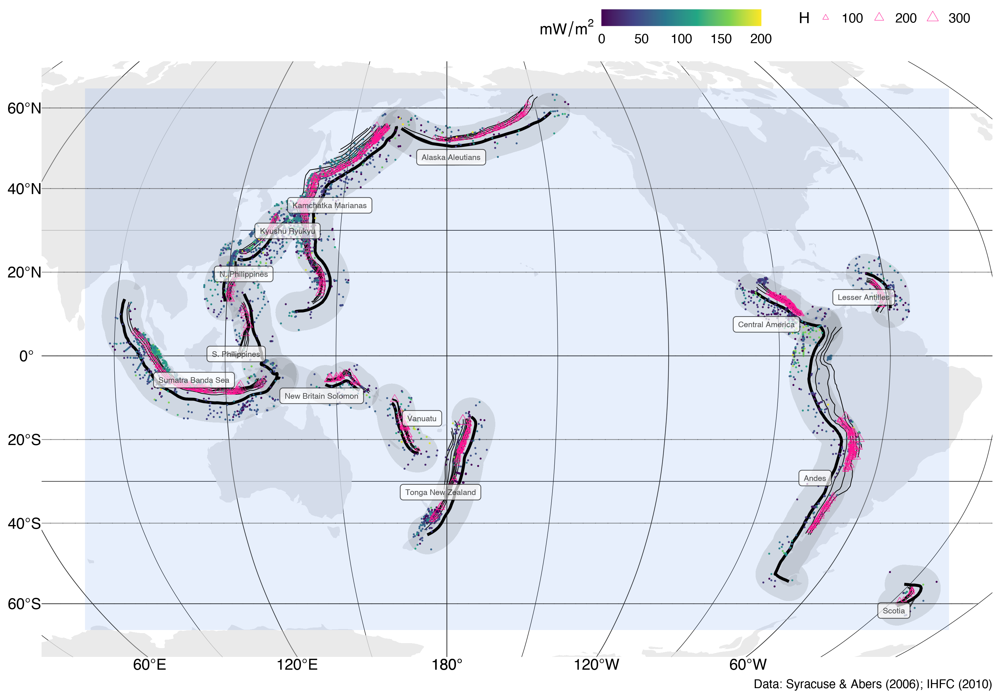

<!-- Main -->

<!-- One -->
<section id="two" class="spotlights">
	<section>
		
		

			

				<header class="major">
					<h3>Reproducible Geoscience</h3>
				</header>
				
Code to reproduce results. Apps for visualization and exploration. All open source.

				
A recent example:

				<ul class="actions">
				<li><a href="https://github.com/buchanankerswell/kerswell_et_al_coupling" class="button">GitHub</a></li>
				<li><a href="https://osf.io/zjac3/" class="button">Open Science Framework</a></li>
				</ul>
			

		

	</section>

	<section>
		
		

			

				<header class="major">
					<h3>Tools for Students</h3>
				</header>
				
An app for calculating Stokes settling velocity of crystals in silicate metls. Perfect for a <a href="https://github.com/buchanankerswell/xtal-sttl">petrology exercise</a>. Try it yourself. Copy and paste these data into the app:

				

					<table>
						<thead>
							<tr>
								<th>ID</th>
								<th>SiO2</th>
								<th>TiO2</th>
								<th>Al2O3</th>
                <th>Fe2O3</th>
								<th>FeO</th>
								<th>MgO</th>
								<th>CaO</th>
                <th>Na2O</th>
								<th>K2O</th>
								<th>H2O</th>
							</tr>
						</thead>
						<tbody>
							<tr>
								<td>NS-115</td>
								<td>40.3</td>
								<td>0.56</td>
								<td>16.24</td>
                <td>0</td>
								<td>5.59</td>
								<td>18.74</td>
								<td>0.73</td>
                <td>5.22</td>
								<td>12.23</td>
								<td>0.272</td>
							</tr>
							<tr>
								<td>AO24</td>
                <td>40.33</td>
								<td>1.73</td>
								<td>3.44</td>
                <td>0</td>
								<td>14.29</td>
								<td>5.79</td>
								<td>1.24</td>
                <td>5.13</td>
								<td>19.55</td>
								<td>0.197</td>
							</tr>
							<tr>
              <td>96025/1</td>
              <td>40.68</td>
              <td>1.79</td>
              <td>17.13</td>
              <td>0</td>
              <td>15.16</td>
              <td>11.87</td>
              <td>9.88</td>
              <td>0.28</td>
              <td>0.44</td>
              <td>0.46</td>
							</tr>
							<tr>
              <td>OLB8IF1</td>
              <td>40.75</td>
              <td>0.92</td>
              <td>7.72</td>
              <td>0</td>
              <td>9.21</td>
              <td>9.18</td>
              <td>0.81</td>
              <td>5.65</td>
              <td>11.79</td>
              <td>0.253</td>
							</tr>
							<tr>
              <td>PED979</td>
              <td>40.83</td>
              <td>1.38</td>
              <td>4.04</td>
              <td>0</td>
              <td>12.45</td>
              <td>8.23</td>
              <td>1.17</td>
              <td>4.86</td>
              <td>19.91</td>
              <td>0.04</td>
							</tr>
						</tbody>
					</table>
				

				<ul class="actions">
					<li><a href="https://kerswell.shinyapps.io/xtal-sttl" class="button">App</a></li>
				</ul>
			

		

	</section>

  <section>
		
		

			

				<header class="major">
					<h3>Surface Heat Flow Near Arcs</h3>
				</header>
				
A short paper on the subject of surface heat flow near volcanic arcs

				<ul class="actions">
				<li><a href="assets/html/heatflow.html" class="button">View</a></li>
				</ul>
			

		

	</section>

	<section>
		
		

			

				<header class="major">
					<h3>Guided Bike Tour: Boulder, Utah</h3>
				</header>
				
Four-day guided bike tour through the beautiful red rock Mesezoic section of Southern Utah.

				<ul class="actions">
					<li><a href="assets/html/bbb.html" class="button">Guide de Cours</a></li>
				</ul>
			

		

	</section>

  <section>
    
    

      

        <header class="major">
          <h3>New Project: Treasure Trove</h3>
        </header>
        
Treasure Trove is a bicycle route guide for the Boise area. New routes coming soon!

        <ul class="actions">
          <li><a href="https://boisetreasuretrove.com" class="button">Visit</a></li>
        </ul>
      

    

  </section>
</section>

<!-- Three -->
<section id="three">
	

		<header class="major">
			<h2>Interested?</h2>
		</header>
		
Think I'm a good fit for your lab? Have funding or want to write a proposal? Please get in contact.

		<ul class="actions">
			<li><a href="resume.html" class="button next">Resumé</a></li>
      <li><a href="proposals.html" class="button next">Proposals</a></li>
		</ul>
	

</section>

