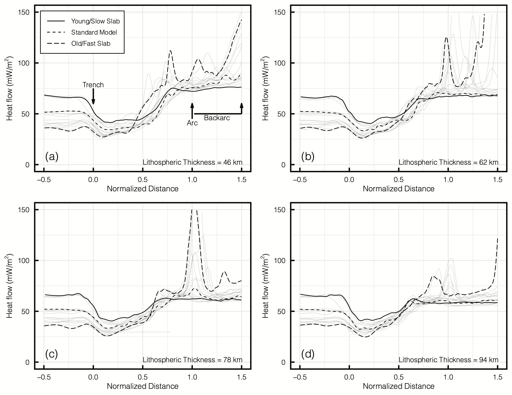
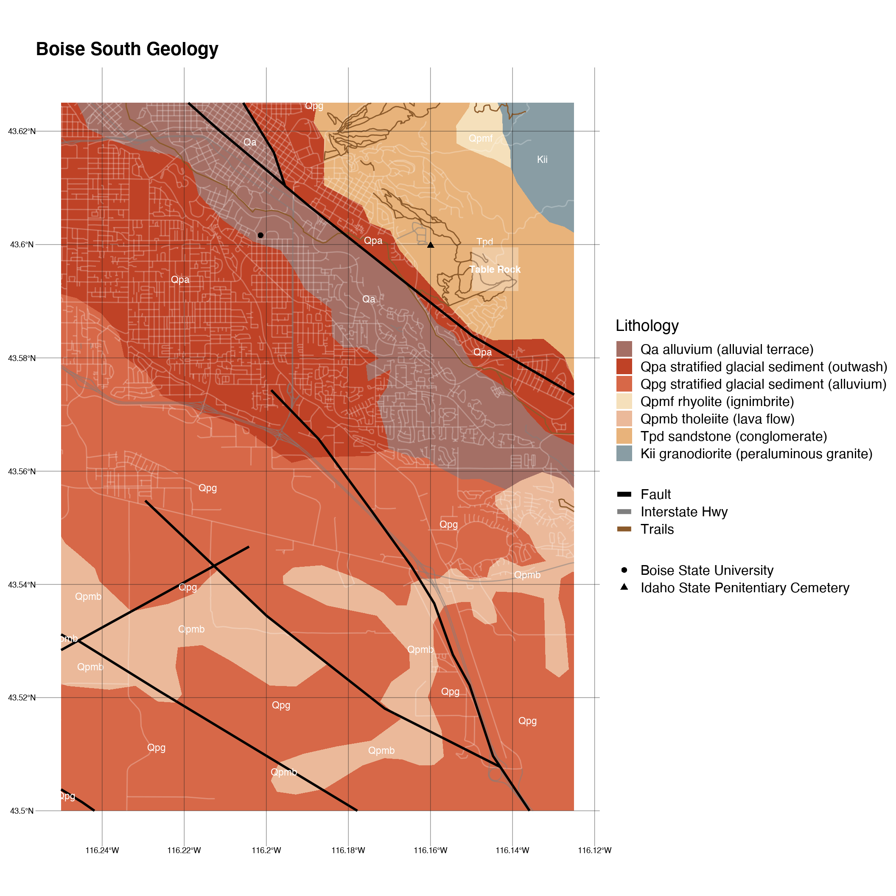
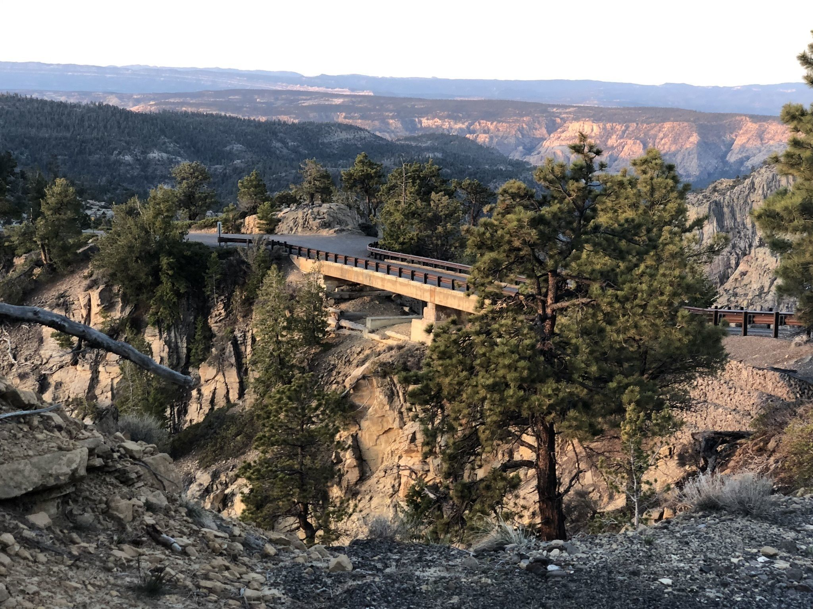

<!-- Main -->

<!-- One -->
<section id="two" class="spotlights">
	<section>
		
		

			

				<header class="major">
					<h3>Reproducible Geoscience</h3>
				</header>
				
Code and apps to reproduce results. An example:

				<ul class="actions">
				<li><a href="https://github.com/buchanankerswell/kerswell_et_al_coupling" class="button">GitHub</a></li>
				<li><a href="https://osf.io/zjac3/" class="button">Open Science Framework</a></li>
					<li><a href="https://kerswell.shinyapps.io/coupling_app/?_ga=2.70706768.1564226589.1607628982-904544027.1607496859" class="button">App</a></li>
				</ul>
			

		

	</section>
	<section>
		
		

			

				<header class="major">
					<h3>Map Making Tools for Students</h3>
				</header>
				
Used by students to make maps for final sedimentology and stratigraphy project

				
Try it for yourself. Copy and paste these data:

				

					<table>
						<thead>
							<tr>
								<th>Outcrop</th>
								<th>Latitude</th>
								<th>Longitude</th>
								<th>Elevation</th>
							</tr>
						</thead>
						<tbody>
							<tr>
								<td>TR1</td>
								<td>43.593355</td>
								<td>-116.144052</td>
								<td>3620</td>
							</tr>
							<tr>
								<td>TR2</td>
								<td>43.593775</td>
								<td>-116.147319</td>
								<td>3557</td>
							</tr>
							<tr>
								<td>TR3</td>
								<td>43.594118</td>
								<td>-116.146982</td>
								<td>3605</td>
							</tr>
							<tr>
								<td>TR4</td>
								<td>43.597387</td>
								<td>-116.146797</td>
								<td>3643</td>
							</tr>
							<tr>
								<td>TR5</td>
								<td>43.598737</td>
								<td>-116.147453</td>
								<td>3662</td>
							</tr>
						</tbody>
					</table>
				

				<ul class="actions">
					<li><a href="https://kerswell.shinyapps.io/TR_map_creator/?_ga=2.123651531.1564226589.1607628982-904544027.1607496859" class="button">App</a></li>
					<li><a href="assets/html/maps.html" class="button">Map Making Vignette</a></li>
				</ul>
			

		

	</section>
	<section>
		
		

			

				<header class="major">
					<h3>Guided Bike Tour—Boulder, Utah</h3>
				</header>
				
Guide de cours

				<ul class="actions">
					<li><a href="assets/html/bbb.html" class="button">View</a></li>
				</ul>
			

		

	</section>
</section>

<!-- Three -->
<section id="three">
	

		<header class="major">
			<h2>Interested?</h2>
		</header>
		
I am for hire. Please review my resumé and get in contact.

		<ul class="actions">
			<li><a href="cv.html" class="button next">Resumé</a></li>
		</ul>
	

</section>

